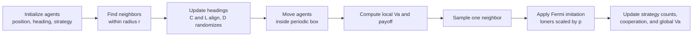

# Vicsek-Loner Showcase

[中文说明 / Chinese Version](./README.zh-CN.md)

[](https://xiaoshuntian.github.io/vicsek-loner-showcase/)
[](./assets/Video.mp4)
[](./README.md)

A lightweight GitHub-facing interactive demo for visualizing a small-scale version of the `Vicsek + evolutionary game + loner` model used in this project.

This repository is not meant to replace the MATLAB research code. Its job is different: it makes the mechanism visible.

- agents move in a periodic 2D box
- neighbors are defined by interaction radius `r`
- cooperators and loners align with local average heading
- defectors move with random headings
- strategy updates follow a Fermi imitation rule
- loners imitate with an extra factor `p`

The default scene runs `10` agents for `20` rounds so the evolution is small enough to inspect, but still rich enough to show how local interactions generate global behavior.

## Quick Look

You can watch the demo video directly inside the repository page:

<video src="./assets/Video.mp4" controls preload="metadata" width="900"></video>

If your GitHub client does not render the video inline, open it here: [`assets/Video.mp4`](./assets/Video.mp4)

## One-Minute Overview

This project turns an abstract swarm-game model into something you can immediately see:

- who is aligning with neighbors
- who is moving randomly
- how strategies spread
- how global order `Va` and cooperation emerge from local interactions

If you only want the shortest path:

1. open the [live page](https://xiaoshuntian.github.io/vicsek-loner-showcase/)
2. press `Play`
3. change `r`, `p`, `alpha`, and `eta`
4. compare the motion panel with the two time-series charts

## Why This Repo Exists

In the MATLAB experiments, we mainly observe aggregate outputs such as:

- global order parameter `Va`
- cooperation level
- strategy frequencies

Those figures are important, but they do not directly answer a basic question:

`What do the agents actually look like while they evolve?`

This repository exists to answer that question quickly and visually.

## Research Background

Collective behavior in autonomous systems is often studied from two complementary perspectives:

- motion coordination: how agents align, cluster, and move as a group
- strategic adaptation: how agents change behavior under local interaction incentives

The project behind this repository combines those two layers into a single model:

- a Vicsek-style active matter dynamics for motion
- an evolutionary game mechanism for strategy change
- a loner option that allows temporary disengagement from costly strategic interaction

This combination is useful because real multi-agent systems rarely face only a motion problem or only a game problem. In practice, they often need to move, coordinate, and adapt behavior at the same time.

## Research Questions

The broader project is motivated by questions such as:

- How does local alignment affect the emergence of cooperation?
- How do radius, noise, and cost reshape collective order?
- What role does the loner strategy play in stabilizing or disrupting group behavior?
- When do local interaction rules create clear macro-level structure in `Va`, cooperation, and strategy frequency?

The visualization in this repository is a small but useful front-end to those questions.

## Live Links

- Repository: `https://github.com/xiaoshuntian/vicsek-loner-showcase`
- GitHub Pages: `https://xiaoshuntian.github.io/vicsek-loner-showcase/`
- Demo video file: `./assets/Video.mp4`

## Model Flow



## Method Overview

At the project level, the workflow can be summarized like this:

1. define the motion-game parameters
2. run repeated simulations in MATLAB for larger-scale quantitative experiments
3. aggregate outputs such as `Va`, cooperation level, convergence time, and final strategy proportions
4. use this browser demo to make the underlying mechanism legible at the agent level

That means the MATLAB project provides the quantitative evidence, while this repository provides the interpretability layer.

## Mapping to the MATLAB Code

The browser demo is intentionally aligned with the core rules in:

- `simulation_loner.m`
- `is_neighbour.m`
- `neighbour_to_imitate.m`

It preserves the same high-level logic:

1. Position update  
   Agents move with constant speed `v0` in a periodic square box.

2. Neighbor detection  
   Two agents are neighbors when their periodic distance is smaller than `r`.

3. Heading update  
   - `C` and `L` align with local average heading plus noise `eta`
   - `D` selects a random new heading

4. Payoff update  
   - local order `Va_i` is computed from the current neighborhood
   - communication introduces a cost
   - payoff is `Va_i - alpha * cost`

5. Strategy update  
   Each agent samples one neighbor and imitates under the Fermi rule.  
   Loners use `p * FermiProb`.

That makes this repository useful for explanation and outreach, while the MATLAB code remains the source of research-grade quantitative results.

## What the Page Shows

The landing page is organized into three parts:

1. A hero section introducing the model and embedding a playable video.
2. A spatial animation panel showing positions, headings, and interaction radii.
3. Two chart panels showing strategy frequencies and the time series of global `Va` and cooperation.

This layout helps readers connect micro-level motion to macro-level statistics.

## Project Highlights

What makes this repository useful as a research-facing showcase:

- It translates a mathematically defined swarm-game model into an immediately interpretable animation.
- It connects micro-level spatial behavior with macro-level indicators in the same view.
- It lowers the barrier for mentors, collaborators, and reviewers who do not want to start from MATLAB source code.
- It provides a compact demonstration asset for reports, presentations, onboarding, and project pages.

What makes the broader project interesting:

- It studies collective intelligence through the coupling of motion and strategic evolution.
- It explicitly includes a loner mechanism instead of forcing only cooperate/defect dynamics.
- It tracks both ordering and strategic composition rather than treating them as separate problems.

## Suggested Parameter Reading

For first-time exploration, these parameters are the most informative:

- `r`: controls who can influence whom
- `p`: controls how easily loners imitate neighbors
- `alpha`: scales communication cost
- `eta`: controls directional noise

A simple intuition is:

- larger `r` often strengthens local coupling
- larger `eta` usually makes alignment harder
- larger `alpha` makes costly strategies less attractive
- changing `p` changes how loners re-enter strategic competition

## Project Structure

```text
vicsek-loner-showcase/
├─ index.html          # landing page and interface layout
├─ styles.css          # visual design
├─ app.js              # simulation rules and drawing logic
├─ assets/
│  └─ Video.mp4        # recorded demo
├─ README.md           # English entry page
└─ README.zh-CN.md     # Chinese entry page
```

## Intended Audience

This repository is designed for:

- teammates who want to understand the model before reading MATLAB
- mentors or reviewers who need a fast visual explanation
- readers arriving from GitHub or GitHub Pages
- students who want a compact demo before running larger simulations

## How to Use

Open `index.html` locally, or use the GitHub Pages site.

Controls let you change:

- number of agents
- number of rounds
- radius `r`
- loner factor `p`
- relative cost `alpha`
- noise `eta`
- speed `v0`
- random seed

Buttons:

- `Reset`: generate a fresh simulation under the current settings
- `Play`: animate the rollout
- `Step`: advance one round
- `Run 20 Rounds`: finish the rollout immediately

## Relationship to the MATLAB Project

This repository should be treated as the front door, not the full lab:

- use this repo to explain the mechanism
- use the MATLAB project to generate formal results
- use both together for presentation, onboarding, and discussion

## Repository Role in the Full Research Stack

You can think of the full project in three layers:

- theory layer: Vicsek dynamics, Fermi imitation, loner mechanism
- experiment layer: MATLAB scripts, sweeps, repeated runs, aggregate metrics
- communication layer: this repository, the demo video, and the GitHub Pages site

This repository mainly serves the third layer, but it is grounded in the first two.

## Future Extensions

Good next upgrades include:

- side-by-side comparison with MATLAB output snapshots
- parameter presets matching paper figures
- GIF export for reports or presentations
- a larger-`N` demonstration mode
- direct links from the demo to the corresponding MATLAB scripts and paper figures

## Notes

This demo is designed for explanation, onboarding, and outreach.  
The research-grade quantitative results should still come from the MATLAB project.
