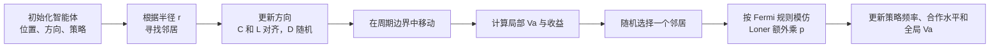

# Vicsek-Loner Showcase 中文说明

[English Version](./README.md)

[](https://xiaoshuntian.github.io/vicsek-loner-showcase/)
[](./assets/Video.mp4)
[](./README.zh-CN.md)

这是一个面向 GitHub 展示的轻量级交互仓库，用来演示本项目中 `Vicsek + 演化博弈 + loner` 模型在小规模情形下的动态演化。

这个仓库不是为了替代 MATLAB 科研代码，而是为了把机制讲清楚、看清楚。

- 智能体在二维周期边界空间中运动
- 半径 `r` 决定邻居关系
- 合作者和 loner 跟随局部平均方向
- 背叛者随机改变方向
- 策略通过 Fermi 模仿规则更新
- loner 的模仿概率会额外乘以 `p`

默认设置是 `10` 个智能体、`20` 轮演化，目的是让人能够直接看懂过程。

## 快速预览

你可以直接在 GitHub 项目页里观看演示视频：

<video src="./assets/Video.mp4" controls preload="metadata" width="900"></video>

如果你的 GitHub 客户端不支持内嵌播放，也可以直接打开这个文件：[`assets/Video.mp4`](./assets/Video.mp4)

## 一分钟看懂这个仓库

这个仓库做的事情可以概括成一句话：

把原本只出现在 MATLAB 图表里的群体演化机制，变成一个可以直接观察的交互动画。

如果你想最快上手：

1. 打开 [在线页面](https://xiaoshuntian.github.io/vicsek-loner-showcase/)
2. 点击 `Play`
3. 修改 `r`、`p`、`alpha`、`eta`
4. 一边看空间动画，一边看下面两张时间序列图

## 为什么要做这个仓库

在 MATLAB 实验里，我们通常看到的是：

- 全局一致性参数 `Va`
- 合作水平
- 三种策略频率

这些图很重要，但它们不会直接回答一个非常自然的问题：

`这些智能体到底是怎么动起来的？`

这个仓库就是为了把这个问题回答得更直观。

## 研究背景

群体智能与无人系统中的集体行为，通常可以从两个互补视角来理解：

- 运动协调：个体如何对齐、聚集并形成群体运动
- 策略演化：个体如何在局部交互激励下改变行为

本项目把这两层耦合在了一起：

- 用 Vicsek 风格的活性粒子模型描述运动
- 用演化博弈描述策略更新
- 用 loner 机制表示个体可以暂时退出高成本交互

这种组合之所以重要，是因为真实多智能体系统往往不是只面对“怎么运动”或只面对“怎么博弈”其中一个问题，而是需要一边运动、一边协调、一边调整行为。

## 研究问题

这个项目更大的研究动机，主要围绕以下问题展开：

- 局部方向对齐会如何影响合作的出现与维持？
- 半径、噪声和代价会怎样改变群体有序性？
- loner 策略在系统中究竟起到稳定作用还是扰动作用？
- 局部交互规则在什么条件下会形成清晰的宏观模式，比如 `Va`、合作水平和策略频率的结构性变化？

这个前端仓库虽然规模小，但正好适合把这些问题背后的机制直观地展示出来。

## 在线入口

- 仓库地址：`https://github.com/xiaoshuntian/vicsek-loner-showcase`
- GitHub Pages：`https://xiaoshuntian.github.io/vicsek-loner-showcase/`
- 演示视频文件：`./assets/Video.mp4`

## 模型流程图



## 方法概览

从整个项目来看，研究流程可以概括成：

1. 设定运动与博弈参数
2. 在 MATLAB 中进行更大规模的重复仿真
3. 汇总 `Va`、合作水平、收敛时间、最终策略比例等指标
4. 用这个浏览器 demo 把底层机制在智能体层面展示出来

也就是说：

- MATLAB 工程负责量化实验
- 这个仓库负责可解释展示

两者合在一起，才构成一个完整的科研项目表达。

## 与 MATLAB 代码的对应关系

这个前端展示版不是随意做的动画，而是尽量和当前 MATLAB 规则保持一致。它主要参考这些文件：

- `simulation_loner.m`
- `is_neighbour.m`
- `neighbour_to_imitate.m`

前端保留了这些核心逻辑：

1. 位置更新  
   智能体以固定速度 `v0` 在正方形周期边界中移动。

2. 邻居判定  
   两个智能体的周期距离小于 `r` 时，视为邻居。

3. 方向更新  
   - `C` 和 `L`：沿局部平均方向前进，并叠加噪声 `eta`
   - `D`：随机选择新的方向

4. 收益更新  
   - 利用局部一致性得到局部 `Va_i`
   - 通信带来代价
   - 收益定义为 `Va_i - alpha * cost`

5. 策略更新  
   每个智能体随机选一个邻居，用 Fermi 规则决定是否模仿；  
   对于 loner，再额外乘以 `p`

因此，这个仓库更适合做“机制解释”和“项目展示”，而真正的科研量化结果仍然应该以 MATLAB 仿真为准。

## 页面里有什么

首页主要分成三部分：

1. 顶部说明区  
   简要介绍模型，并放置可直接播放的演示视频。

2. 空间动画区  
   展示每个智能体的位置、运动方向以及交互半径。

3. 指标图表区  
   展示三种策略频率随时间的变化，以及全局 `Va` 和合作水平的时间序列。

这样做的目的是把“微观怎么动”和“宏观怎么变”放在同一个页面里，方便理解。

## 项目亮点

这个仓库作为展示页，有几个比较强的点：

- 它把一个原本偏公式和代码的模型，变成了可以直接观察的动画
- 它把微观运动和宏观指标放在同一个界面里
- 它降低了导师、队友、评审理解项目的门槛
- 它天然适合作为汇报、答辩、项目主页和 onboarding 材料

这个项目本身的研究亮点则在于：

- 它关注的是“运动”和“策略演化”的耦合，而不是只看其中一层
- 它显式引入了 loner 机制，而不是只局限于 cooperate/defect 二元对抗
- 它同时追踪有序性和策略组成，把群体动力学看成一个整体问题

## 建议优先观察的参数

第一次使用时，最值得先调的参数是：

- `r`：决定邻居范围
- `p`：决定 loner 模仿邻居时的额外缩放
- `alpha`：决定通信代价权重
- `eta`：决定噪声强弱

可以这样理解：

- `r` 越大，局部交互通常越强
- `eta` 越大，对齐越困难
- `alpha` 越大，带成本的策略越不占优
- `p` 会影响 loner 回到竞争状态的容易程度

## 仓库结构

```text
vicsek-loner-showcase/
├─ index.html          # 首页和界面结构
├─ styles.css          # 样式设计
├─ app.js              # 模型规则与绘图逻辑
├─ assets/
│  └─ Video.mp4        # 演示视频
├─ README.md           # 英文主页
└─ README.zh-CN.md     # 中文主页
```

## 这个仓库适合谁看

这个仓库主要适合下面几类读者：

- 想先理解模型机制、还没准备直接读 MATLAB 代码的人
- 想快速看懂项目思路的导师、评审或队友
- 从 GitHub 点进来，希望先看到直观展示的读者
- 想先用小规模案例理解规则，再回到大规模仿真的同学

## 如何使用

你可以直接打开本地 `index.html`，也可以使用 GitHub Pages 在线访问。

页面控件允许你调整：

- 智能体数量
- 演化轮数
- 半径 `r`
- loner 因子 `p`
- 相对代价 `alpha`
- 噪声 `eta`
- 速度 `v0`
- 随机种子

按钮功能如下：

- `Reset`：按当前参数重新生成初始状态
- `Play`：播放动画
- `Step`：向前推进一轮
- `Run 20 Rounds`：直接跑完当前设定轮数

## 和 MATLAB 工程的关系

你可以把这个仓库理解成项目的“前台入口”：

- 用它讲清楚模型机制
- 用 MATLAB 工程做正式仿真和出图
- 在汇报、答辩、项目展示时，把两者配合起来使用

## 在完整研究栈里的位置

你可以把整个项目分成三层来理解：

- 理论层：Vicsek 动力学、Fermi 模仿、loner 机制
- 实验层：MATLAB 脚本、参数扫描、重复实验、统计指标
- 展示层：这个仓库、演示视频和 GitHub Pages 页面

这个仓库主要服务的是第三层，但它的规则来源于前两层，因此不是“花哨动画”，而是有模型基础的展示入口。

## 后续可以继续加强的方向

- 加入与 MATLAB 输出图的对照
- 增加论文参数预设场景
- 输出 GIF 或短视频用于汇报
- 增加更大规模 `N` 的展示模式
- 增加“前端 demo 对应哪段 MATLAB 代码、对应哪张论文图”的一一映射

## 说明

这个仓库的定位是展示、解释和传播。  
正式的科研计算、数据统计和最终图表，仍建议以原 MATLAB 工程为准。
